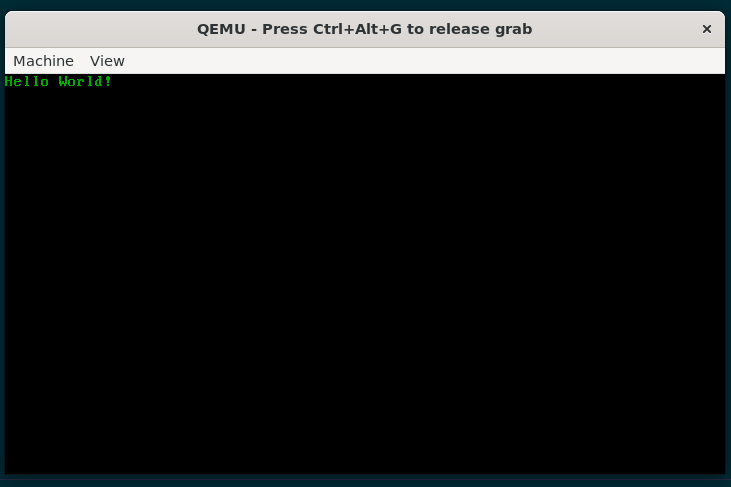

# PrankOS build + run (RAM-only in QEMU)

PrankOS is a tiny Multiboot2 kernel intended for safe testing in QEMU. It runs in memory (RAM) inside the VM. Should theoretically work on some older (but not too old!) computers.

## Dependencies (WSL/Ubuntu)

```bash
sudo apt update
sudo apt install nasm grub-pc-bin xorriso mtools qemu-system-x86
```

## Option A: Cross-compiler toolchain (recommended)

If you have an i686-elf-* cross toolchain installed:

### 1) Assemble boot code

```bash
nasm -f elf32 boot.s -o boot.o
```

### 2) Compile kernel (freestanding C++)

```bash
i686-elf-g++ -c kernel.cpp -o kernel.o -ffreestanding -O2 \
  -fno-exceptions -fno-rtti -fno-stack-protector -fno-pic -fno-pie \
  -fno-threadsafe-statics -mno-sse -mno-sse2 -mno-mmx -mno-80387
```

### 3) Link into a Multiboot2 ELF kernel

```bash
i686-elf-ld -m elf_i386 -z noexecstack -T link.ld -o kernel.elf boot.o kernel.o
```

## Option B: Host compiler (works if you have 32-bit multilib)

If you're using system g++/ld:

### 1) Assemble boot code

```bash
nasm -f elf32 boot.s -o boot.o
```

### 2) Compile kernel

```bash
g++ -m32 -c kernel.cpp -o kernel.o -ffreestanding -O2 \
  -fno-exceptions -fno-rtti -fno-stack-protector -fno-pic -fno-pie \
  -fno-threadsafe-statics -mno-sse -mno-sse2 -mno-mmx -mno-80387
```

### 3) Link

```bash
ld -m elf_i386 -z noexecstack -T link.ld -o kernel.elf boot.o kernel.o
```

## Create a GRUB ISO

```bash
mkdir -p iso/boot/grub
cp kernel.elf iso/boot/kernel.elf
```

Create `iso/boot/grub/grub.cfg`:

```bash
cat > iso/boot/grub/grub.cfg <<'EOF'
set timeout=0
set default=0

menuentry "PrankOS" {
    multiboot2 /boot/kernel.elf
    boot
}
EOF
```

Build the ISO:

```bash
grub-mkrescue -o prankos.iso iso
```

## Run in QEMU

```bash
qemu-system-i386 -cdrom prankos.iso
```

### Optional debugging

```bash
qemu-system-i386 -cdrom prankos.iso -serial stdio -no-reboot
```

## Clean build artifacts

```bash
rm -f *.o kernel.elf prankos.iso
rm -rf iso
```
# Result
